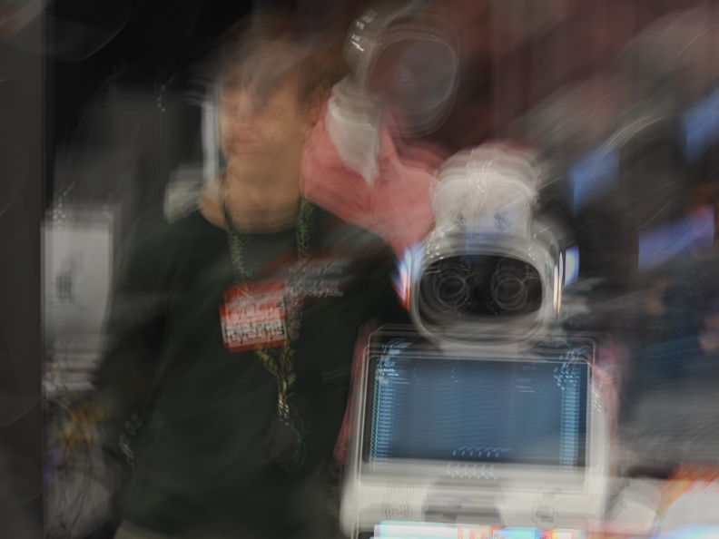
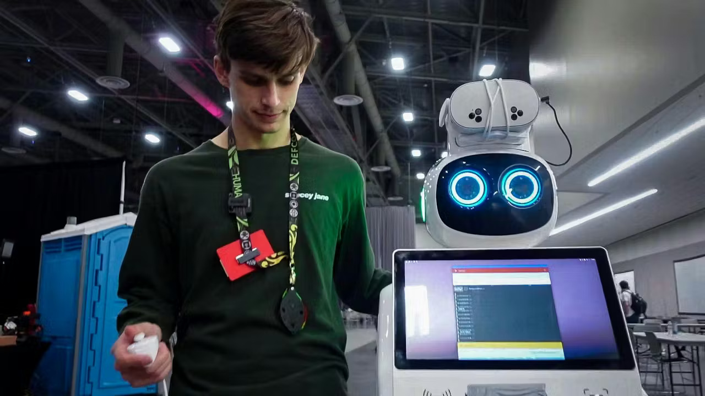
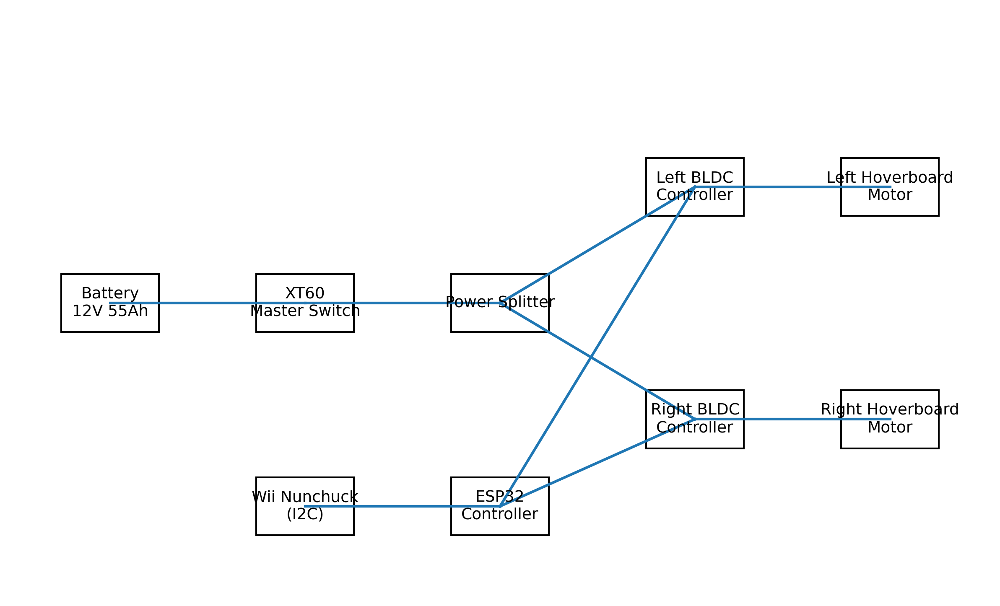
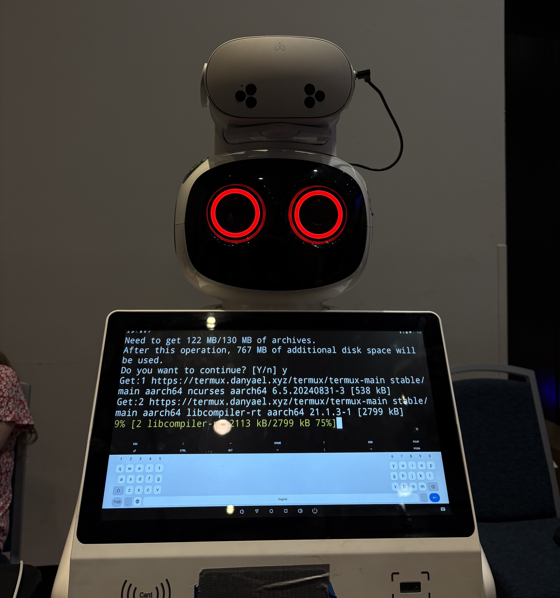

#  Rosie the Wardriver
### A Mobile Wardriving & Cybersecurity Research Platform

> *Transforming an abandoned commercial service robot into an offensive security demonstration unit.*


https://github.com/user-attachments/assets/e21e9d52-4b93-4ee3-905d-d398eb65fceb


###  Press & Media Coverage

| Publication      | Article                                                                                                                                                                                    |
| ---------------- | ------------------------------------------------------------------------------------------------------------------------------------------------------------------------------------------ |
| **Hackster.io**  | [A Networked Porta Potty and More Absurdity at DEF CON's Scavenger Hunt](https://www.hackster.io/news/a-networked-porta-potty-and-more-absurdity-at-def-con-s-scavenger-hunt-475ee8c567ca) |
| **HackerPhotos** | [DEF CON Photo Archive — P8101655](https://www.hackerphotos.com/picture.php?/61246/category/43)                                                                                            |

[](https://www.hackerphotos.com/picture.php?/61246/category/43)
[](https://www.hackster.io/news/a-networked-porta-potty-and-more-absurdity-at-def-con-s-scavenger-hunt-475ee8c567ca)

---

## Table of Contents

- [Rosie the Wardriver](#rosie-the-wardriver)
    - [A Mobile Wardriving \& Cybersecurity Research Platform](#a-mobile-wardriving--cybersecurity-research-platform)
    - [ Press \& Media Coverage](#-press--media-coverage)
  - [Table of Contents](#table-of-contents)
  - [1. Project Overview](#1-project-overview)
    - [Conference Appearances](#conference-appearances)
    - [NUCC Affiliation](#nucc-affiliation)
  - [2. Base Platform](#2-base-platform)
    - [Physical Description](#physical-description)
  - [3. Mechanical Conversion: Mobility System](#3-mechanical-conversion-mobility-system)
    - [3.1 Drive Train Design](#31-drive-train-design)
    - [3.2 Motor Control Hardware](#32-motor-control-hardware)
    - [3.3 Power System](#33-power-system)
      - [Main Battery](#main-battery)
      - [Power Distribution Architecture](#power-distribution-architecture)
  - [4. Control System Architecture](#4-control-system-architecture)
    - [4.1 Microcontroller](#41-microcontroller)
    - [4.2 Control Interface: Wii Nunchuck](#42-control-interface-wii-nunchuck)
    - [4.3 Tank Drive Algorithm](#43-tank-drive-algorithm)
  - [5. Operating System \& Software Stack](#5-operating-system--software-stack)
    - [Android Kiosk System](#android-kiosk-system)
  - [6. Wardriving Stack](#6-wardriving-stack)
    - [6.1 Onboard Android Sensor Suite](#61-onboard-android-sensor-suite)
    - [6.2 Meta Quest 3S Integration](#62-meta-quest-3s-integration)
    - [6.3 Quest 3S Software Stack](#63-quest-3s-software-stack)
  - [7. Kismet + Termux Configuration](#7-kismet--termux-configuration)
  - [8. Power \& Charging Architecture](#8-power--charging-architecture)
  - [9. Aesthetic \& Demonstration Layer](#9-aesthetic--demonstration-layer)
  - [10. System Architecture Diagram](#10-system-architecture-diagram)
  - [11. Use Cases](#11-use-cases)
    - [Conference Demonstration](#conference-demonstration)
    - [Research Platform](#research-platform)
    - [Educational Tool](#educational-tool)
  - [12. Notable Engineering Decisions](#12-notable-engineering-decisions)
  - [13. Future Directions](#13-future-directions)
    - [Rosie v2 Candidates](#rosie-v2-candidates)
  - [Hardware Bill of Materials (Key Components)](#hardware-bill-of-materials-key-components)

---

## 1. Project Overview

**Rosie the Wardriver** is a mobile wardriving and cybersecurity demonstration robot built from a commercial Android-based humanoid service kiosk. Originally designed for restaurants and malls, the platform was stationary and lacked any drive system. This project transformed it into:

- An **autonomous-capable rolling kiosk**
- An **interactive cybersecurity display piece**
- A **WiFi reconnaissance research platform**
- A **conference and DEF CON demo unit**

### Conference Appearances

| Event                         | Role                                                  | Coverage                                                                                                                                                                                                     |
| ----------------------------- | ----------------------------------------------------- | ------------------------------------------------------------------------------------------------------------------------------------------------------------------------------------------------------------ |
| DEF CON 33 Scavenger Hunt     | Active participant / demo unit at the Scav Hunt booth | [Hackster.io](https://www.hackster.io/news/a-networked-porta-potty-and-more-absurdity-at-def-con-s-scavenger-hunt-475ee8c567ca), [HackerPhotos](https://www.hackerphotos.com/picture.php?/61246/category/43) |
| CSUF Cybersecurity Conference | Educational display and demonstration                 | —                                                                                                                                                                                                            |

### NUCC Affiliation

Rosie was built using resources from the **[National Upcycled Computing Collective (NUCC)](https://www.nuccinc.org/)**, a hacker non-profit based in Southern California. NUCC charters decommissioned laptops and networking equipment to local schools, running cybersecurity programs for students learning ethical hacking. The organization currently maintains 5 storage units of donated hardware for student and member projects.

Rosie debuted publicly at the **DEF CON 33 Scavenger Hunt** alongside other NUCC projects including the viral *Trauma Dump: Hacker Confessional* porta potty and the *SODA Machine* (Shell-on-Demand-Appliance), which dispenses Linux VPS credentials by distro flavor.

---

## 2. Base Platform

### Physical Description

The base unit is a **commercial humanoid service robot** originally marketed as a restaurant waiter, mall telepresence bot, or smart kiosk assistant.

| Component        | Description                         |
| ---------------- | ----------------------------------- |
| **Upper Screen** | Touchscreen Android tablet          |
| **Lower Screen** | Large non-touch advertising display |
| **OS**           | Android (stock firmware)            |
| **Power**        | Internal battery + power management |
| **Head Module**  | Dual camera "eyes"                  |
| **Mobility**     | None (stationary base)              |

> The robot arrived with no drive system — the entire mobility platform was designed and built from scratch.

---

## 3. Mechanical Conversion: Mobility System

### 3.1 Drive Train Design

Rosie was converted to a **differential drive (tank steering)** robot using repurposed hoverboard components.

```
   Left Motor        Right Motor
        \                /
         \              /
          Tank Differential Steering
               |      |
           [Caster] [Caster]
```

**Drive Components:**

| Part           | Details                                              |
| -------------- | ---------------------------------------------------- |
| Drive motors   | Hoverboard BLDC hub motors (integrated Hall sensors) |
| Drive wheels   | 2× (left/right)                                      |
| Balance wheels | 2× caster wheels                                     |

---

### 3.2 Motor Control Hardware

Each wheel is independently driven for full tank steering capability.

| Controller              | Specs                                       |
| ----------------------- | ------------------------------------------- |
| RioRand BLDC Controller | 350W, 6–60V, PWM, with Hall sensor support  |
| DC BLDC Driver          | 400W, 6–60V, 3-Phase, Forward/Reverse/Brake |

---

### 3.3 Power System

#### Main Battery
- **Mighty Max ML55-12INT** — 12V, 55Ah AGM Sealed Lead-Acid

#### Power Distribution Architecture

```
12V 55Ah SLA Battery
         |
   XT60 Master Switch
         |
      XT60 Splitter
      /           \
 Left ESC       Right ESC
```

**Power Hardware:**

| Component                    | Purpose                |
| ---------------------------- | ---------------------- |
| XT60 connectors              | High-current main bus  |
| XT60 splitter cables (14AWG) | Power distribution     |
| XT60 to O-ring terminals     | ESC connections        |
| Inline XT60 power switch     | Master kill switch     |
| Ferrule crimped terminals    | Clean wire termination |
| Lever splice connectors      | Secondary distribution |

---

## 4. Control System Architecture

### 4.1 Microcontroller

**ESP32 DevKitC (ESP-WROOM-32)**

| Feature             | Use                                   |
| ------------------- | ------------------------------------- |
| Dual-core processor | PWM generation + input handling       |
| WiFi + Bluetooth    | Wireless telemetry / future expansion |
| USB-C power         | Clean low-voltage supply              |
| I2C bus             | Wii Nunchuck interface                |

---

### 4.2 Control Interface: Wii Nunchuck

The robot is driven using a **Nintendo Wii Nunchuck** over I2C — an elegant, low-cost, ergonomic hacker solution.

**Hardware:**
- Nintendo Wii Nunchuck
- Nunchuck extension cable
- Jumper wires to ESP32 I2C pins

**Control Mapping:**

| Input           | Function          |
| --------------- | ----------------- |
| Joystick Y-axis | Forward / Reverse |
| Joystick X-axis | Left / Right turn |
| C Button        | Mode toggle       |
| Z Button        | Brake             |

---

### 4.3 Tank Drive Algorithm

```c
// Core differential drive mixing
float forward = joystickY;
float turn    = joystickX;

float leftMotor  = forward + turn;
float rightMotor = forward - turn;
```

**Features implemented:**
- Deadzone filtering
- PWM scaling
- Soft start ramp
- Hall sensor compatibility

---

## 5. Operating System & Software Stack

### Android Kiosk System

Rosie's upper touchscreen runs Android with a full security research toolkit installed.

**Upper Screen (Interactive):**
- Termux terminal emulator
- WiGLE wardriving app
- Kismet viewer
- Interactive conference demo interface

**Lower Screen (Display):**
- Cyber visualization animations
- ASCII art / "cyber flame" animation
- Live scan data readout
- Conference branding

---

## 6. Wardriving Stack

### 6.1 Onboard Android Sensor Suite

| Component                                 | Role                           |
| ----------------------------------------- | ------------------------------ |
| WiGLE WiFi                                | Wardriving + GPS logging       |
| Termux                                    | Package management + scripting |
| Custom scripts                            | Automation + display           |
| Bingfu dual-band MIMO antennas (2.4/5GHz) | Extended RF sensing            |
| RP-SMA extension cables                   | Antenna positioning            |

---

### 6.2 Meta Quest 3S Integration

A **Meta Quest 3S** headset is mounted to the robot using a custom 3D-printed bracket, adapted from [QuestNav](https://www.printables.com/model/1100711-quest-3s-headset-mount-for-robots-and-autonomous-v), adding a second independent sensor node which can run Kali Nethunter or Kismet/WiGLE.

**Mount Design:**
- Tight-fit PLA+ printed chassis mount
- Zip-tie cable retention channels
- USB-Ethernet secured via rear routing channel
- Bungee retention backup system
- 10-32 bolt interface to robot chassis

**Print Settings:**

| Parameter    | Value         |
| ------------ | ------------- |
| Material     | eSUN PLA+     |
| Infill       | 15%           |
| Layer height | 0.2mm         |
| Supports     | Tree supports |

---

### 6.3 Quest 3S Software Stack

```
┌────────────────────────┐     ┌────────────────────────┐
│  Android Robot          │     │  Meta Quest 3S          │
│  ─────────────────────  │     │  ─────────────────────  │
│  WiGLE (GPS + WiFi log) │  +  │  Kali NetHunter/Termux  │
│ Termux/Kali nh (minimal)│     │  Kismet (monitor mode)  │
│  External MIMO antennas │     │ WiGLE (GPS + WiFi log)  │
└────────────────────────┘     └────────────────────────┘
            │                               │
            └───────────────┬───────────────┘
                            ▼
               Dual-Sensor Wardriving Platform
```

---

## 7. Kismet + Termux Configuration

**Capabilities on Quest + Android:**

| Feature                           | Status |
| --------------------------------- | ------ |
| Passive WiFi detection            | ✅      |
| Hidden SSID capture               | ✅      |
| Channel hopping                   | ✅      |
| Live packet visualization         | ✅      |
| Monitor mode via external adapter | ✅      |

**Hardware supporting this:**
- Monitor mode capable USB WiFi adapters
- External antenna support via RP-SMA
- USB-C custom pigtail cables
- Magnetic pogo pin power connectors for clean integration

---

## 8. Power & Charging Architecture
<!-- insert wiring diagram here -->
[](rosie_wiring_diagram.png)

Rosie uses a modular, field-serviceable power design:

| Feature         | Implementation                              |
| --------------- | ------------------------------------------- |
| Primary power   | Magnetic pogo pin connectors                |
| USB devices     | USB-C pigtail cables                        |
| External access | Charge ports accessible without disassembly |
| Headset mount   | Fully removable for transport               |

This architecture enables:
- Fast field servicing
- Clean internal wiring routing
- Modular hardware upgrades between events

---

## 9. Aesthetic & Demonstration Layer
[](https://www.hackerphotos.com/picture.php?/61246/category/43)

Rosie is designed to be visually striking at conferences.

| Feature           | Description                             |
| ----------------- | --------------------------------------- |
| Animated LED eyes | Red / purple configurable modes         |
| Lower display     | Live "cyber flame" animation            |
| Upper screen      | Live terminal + WiGLE map               |
| Chassis           | Tank drive wheels visible at rear       |
| Kill switch       | XT60 external, accessible without tools |
| Branding          | Conference decals applied               |

---

## 10. System Architecture Diagram

```
                    ┌─────────────────┐
                    │  Meta Quest 3S  │
                    │  Kali + Kismet  │
                    └────────┬────────┘
                             │ USB / WiFi
                             │
          ┌──────────────────┴──────────────────┐
          │                                     │
 ┌────────┴────────┐                 ┌──────────┴──────────┐
 │  Android Robot  │                 │   ESP32 Controller   │
 │  WiGLE + Termux │                 │   Motor Control      │
 └────────┬────────┘                 └──────────┬──────────┘
          │                                     │
 ┌────────┴────────┐                 ┌──────────┴──────────┐
 │ External MIMO   │                 │   BLDC Controllers   │
 │ Antennas        │                 │   (2× RioRand)       │
 └────────┬────────┘                 └──────────┬──────────┘
          │                                     │
        WiFi                          Hoverboard Hub Motors
       Sensing                         (Differential Drive)
```

---

## 11. Use Cases

### Conference Demonstration
Rosie serves as a live, interactive conference demo unit — driving around floors while logging WiFi networks, displaying live scan data, and engaging attendees through her touchscreen interface.

### Research Platform
As a mobile wardriving node, Rosie can:
- Map RF signal density across physical spaces
- Perform mobile WiFi reconnaissance
- Visualize live packet data in real time

### Educational Tool
Rosie has been used to teach concepts including:
- Differential drive robotics and motor control
- Embedded systems programming (ESP32 / I2C)
- Offensive security principles (WiFi reconnaissance)
- IoT and Android security research
- Practical application of Kali Linux / NetHunter

---

## 12. Notable Engineering Decisions

| Decision                                | Why It's Notable                                                                                                                                                                             |
| --------------------------------------- | -------------------------------------------------------------------------------------------------------------------------------------------------------------------------------------------- |
| Hoverboard motors as drive system       | Low cost, high torque, integrated Hall sensors — purpose-built for ground robotics reuse                                                                                                     |
| Wii Nunchuck over I2C                   | Ergonomic, cheap, hackable — a classic embedded hacker move                                                                                                                                  |
| Dual wardriving stack (Android + Quest) | Redundant, independent sensor nodes increase RF coverage and tool diversity                                                                                                                  |
| XT60 power architecture                 | Borrowed from the FPV drone community — handles high-current with clean, tool-free connectors                                                                                                |
| Custom 3D printed Quest mount           | No off-the-shelf solution existed; designed and printed to precise fit, adapted from [QuestNav](https://www.printables.com/model/1100711-quest-3s-headset-mount-for-robots-and-autonomous-v) |
| Magnetic pogo pin connectors            | Enables fast servicing and clean aesthetics without permanent wiring                                                                                                                         |

---

## 13. Future Directions

### Rosie v2 Candidates

| Upgrade                      | Description                                                     |
| ---------------------------- | --------------------------------------------------------------- |
| **Autonomous SLAM**          | Implement [QuestNav](https://questnav.gg/) + ROS 2 for self-navigating wardriving       |
| **Inline fuse protection**   | Critical safety upgrade for 55Ah SLA system                     |
| **12V→5V buck converter**    | Cleaner regulated power for ESP32 and accessories               |
| **DC step-down for Android** | Eliminate reliance on internal battery for upper system         |
| **Ground isolation**         | Prevent ESC switching noise from interfering with Android/ESP32 |
| **Red team hardening**       | Encrypted comms, VPN tunnel, stealth wardriving mode            |
| **GPS integration**          | Add external GPS to Quest node for precise WiGLE mapping        |
| **LTE backhaul**             | Real-time exfil of wardrive data to remote server               |

---

## Hardware Bill of Materials (Key Components)

| Component                         | Qty   | Notes                 |
| --------------------------------- | ----- | --------------------- |
| Commercial humanoid Android kiosk | 1     | Base platform         |
| Hoverboard BLDC hub motors        | 2     | Drive wheels          |
| RioRand 350W BLDC controller      | 2     | Motor drivers         |
| ESP32 DevKitC (WROOM-32)          | 1     | Main controller       |
| Mighty Max ML55-12 (12V 55Ah SLA) | 1     | Main power            |
| XT60 connectors + splitter        | 1 set | Power distribution    |
| Wii Nunchuck + extension cable    | 1     | Drive controller      |
| Meta Quest 3S                     | 1     | Secondary sensor node |
| Bingfu 2.4/5GHz MIMO antennas     | 2+    | RF sensing            |
| RP-SMA extension cables           | 2+    | Antenna routing       |
| Magnetic pogo pin connectors      | 1 set | Modular power         |
| PLA+ filament (eSUN)              | ~200g | Quest mount print     |
| Caster wheels                     | 2     | Balance/support       |

---

*Built by Stephen Lyons. Displayed at DEF CON 33 Scavenger Hunt and CSUF Cybersecurity Conference - OSSCON 2025.*  
*Featured in [Hackster.io](https://www.hackster.io/news/a-networked-porta-potty-and-more-absurdity-at-def-con-s-scavenger-hunt-475ee8c567ca) by Alex Lynd. Photography archived at [HackerPhotos](https://www.hackerphotos.com/picture.php?/61246/category/43).*  
*A project of the [National Upcycled Computing Collective](https://www.nuccinc.org/).*
